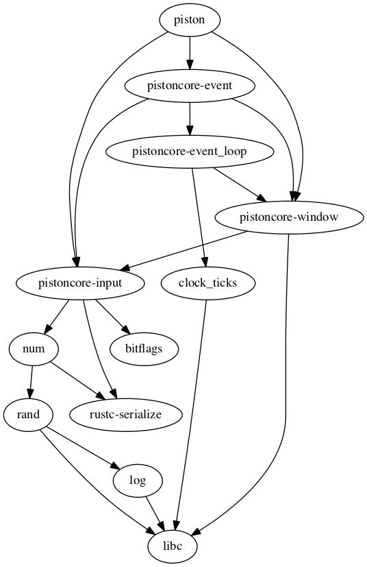

# Piston [](https://travis-ci.org/PistonDevelopers/piston)

A user friendly game engine written in Rust

Maintainers: @bvssvni

[Examples](https://github.com/pistondevelopers/piston-examples)

[List of features](https://github.com/PistonDevelopers/piston/issues/668)

[List of games made with Piston](https://github.com/PistonDevelopers/piston/wiki/Games-Made-With-Piston)

[Piston online docs](http://www.piston.rs/docs/piston/piston/index.html)

[How to contribute](https://github.com/PistonDevelopers/piston/blob/master/CONTRIBUTING.md)

| Back-ends |
|--------------------|
| [glfw_window](https://github.com/pistondevelopers/glfw_window) |
| [glutin_window](https://github.com/pistondevelopers/glutin_window) |
| [sdl2_window](https://github.com/pistondevelopers/sdl2_window) |

## Start new project with Piston

Use one of the [examples](https://github.com/pistondevelopers/piston-examples) as guide.

Almost all projects written in Rust use the Cargo package manager.

1. Install [Cargo](https://github.com/rust-lang/cargo)
2. Open the Terminal window and type:

```
cargo new --vcs git --bin "mygame"
```

This will create a new folder "mygame" that contains a `Cargo.toml` and a folder `src`.
Inside the `src` folder where you put the source code.
For binaries, the default entry file is `src/main.rs` and for libraries `src/lib.rs`.

When you type `cargo run` it will print "Hello, world!".

The `Cargo.toml` file is where you put the library dependencies.

*TIP: Copy links from [/r/rust_gamedev/wiki/index](http://www.reddit.com/r/rust_gamedev/wiki/index).*

For example, to use the SDL2 back-end, add the following to `Cargo.toml`:

```
[dependencies.pistoncore-sdl2_window]

git = "https://github.com/pistondevelopers/sdl2_window"
```

Then add `extern crate sdl2_window;` to the `main.rs` file.

* To compile, use `cargo build`
* To run, use `cargo run`
* To generate docs, use `cargo doc`

You will find more documentation about Cargo [here](http://doc.crates.io/).

## How to build Piston

1. Install [Cargo](https://github.com/rust-lang/cargo)
2. Open up the Terminal window and type:

```
git clone https://github.com/PistonDevelopers/piston
cd piston
cargo build
```

## Goals

The Piston project is a large collaboration among many developers.
There are libraries for 2D, 3D, event programming, AI, image processing etc.
By sharing the maintenance, we get more time to build new stuff.

Piston is as much a community project as it is a collection of libraries.
Writing and maintaining code is expensive, and by sharing this cost we reach our goals faster.
We believe that seeking personal goals and ambitions, while helping each other, results in higher quality.

* Our main goal is to free up time for maintainers and the people involved
* ... such that we can create new amazing stuff and reach our personal goals
* ... by making more people use Rust for game development and become engaged in open source

In addition we do research or plan to in the following areas:

* Graphics, 2D and 3D
* Idiomatic Rust game design
* Interactive applications
* AI programming
* Animation
* Sound and music
* Network

### Dependency graph



